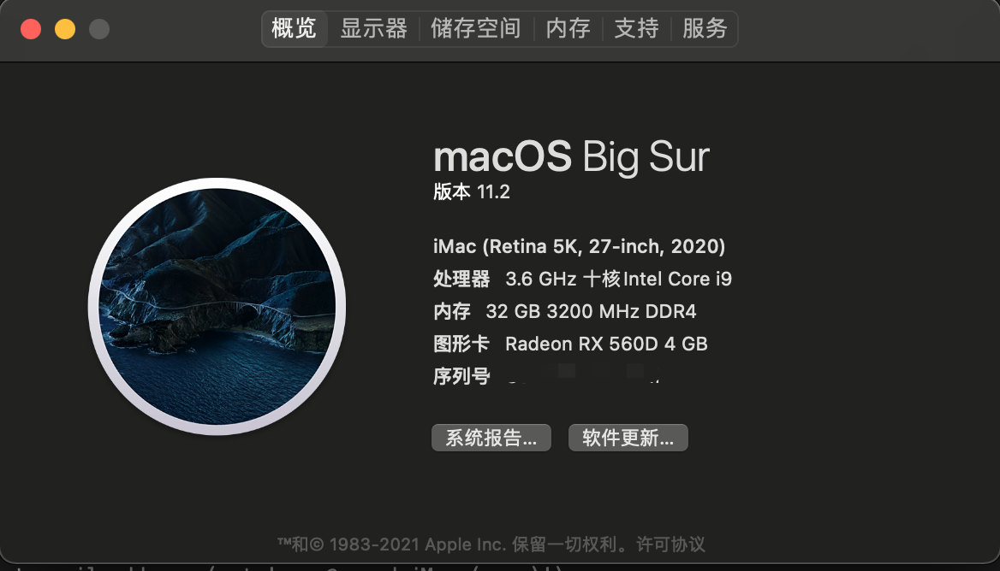
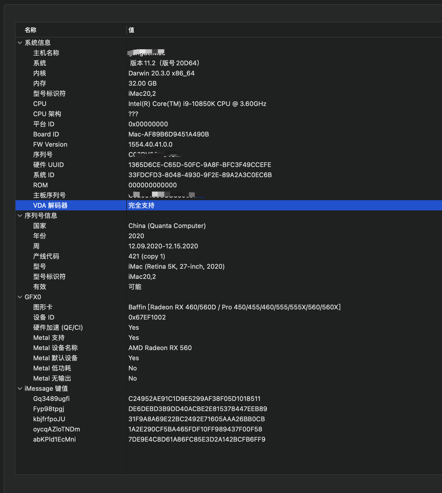

# Gigabyte-Z490-GAMING-X-10850k-RX560D-OpenCore

### 硬件配置：

* 主板: 技嘉 Z490 GAMING X
* cpu: Intel i9-10850k
* 内存: 金士顿 32G DDR4 3200 骇客神条
* 独显: 盈通 RX 560D 
* 散热: 九州风神AS500 Plus(5热管/双层扇叶)
* 硬盘: 三星 1TB 970 EVO
* 电源: 海盗船 全模组电源 650W     
* 无线网卡与蓝牙: BCM94360CD （蓝牙 wifi 2合一）

 

 
